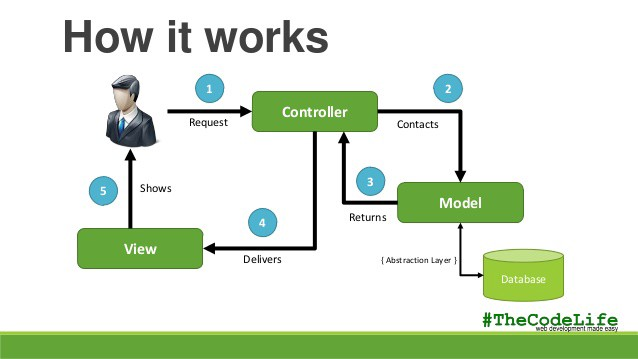

Designing Universally Understandable Code

What are design patterns? How can an employee design code in a simple way that is functional? Over the years programmers have begun using the methods when organizing and writing code. As time went on patterns started to become more prevalent in peoples code and design patterns were set. As these patterns started to become a recurring design pattern standards. By standardizing these patterns programmers were given a tool to write code that can be shared and be understood universally by everyone. This allows other programmers to contribute to the same code without changing the functionality of a program.

Design patterns can also define other properties besides code organization. One of these design patterns that I have been using in my sofware engineering class(ICS 314) is Model-View-Controller(MVC). MVC is a design pattern that is used to decouple the internal representation of information from the way it is presented to and accepted from the user. This design pattern is used in web applications. For my final project for ICS 314 we created a web application using meteor. In our application we have code that runs on the client that renders information and code that runs on our webserver. These two programs communicate to eachother in a way that allows the data to be primarily stored on the server instead of sending everything to the client at once. This design pattern is what distributed programs such as web applications use. Using this design patter users are able to run applications in an unconventional in a sense that they dont have to download a .exe instead they visit a url that will connect them to an application running on a web server.

