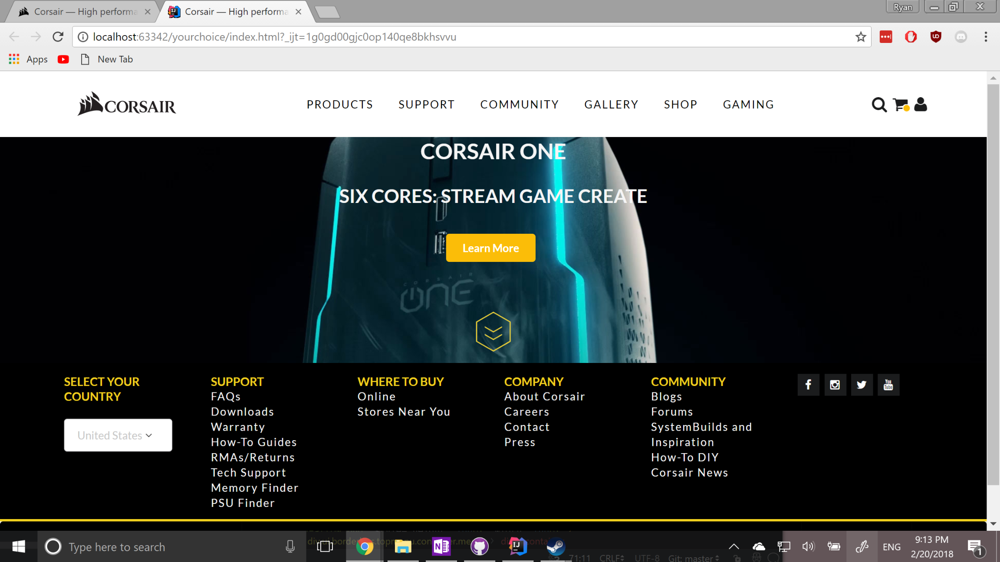

Web Design for Everyone

Over the past two weeks my software engineering class has been focusing on website design and UI. We started off with the bare basics by writing our own CSS stylesheets for the first week. As I was going through the routine, I found myself googling a lot of the examples and just referencing previous assignments having to constantly switch between my IDE and Chrome just to look at past examples. In the end, the pages were bleak and left something to be desired. The next week we were introduced to Semantic UI, a UI framework that aims to make UI design implementation syntax "semantic", hence the name. Semantic takes a different approach to web design when compared to other UI frameworks. When implementing semantic, you are referencing semantics .css file's classes. The naming convention of these classes makes adding them to your code semantically logical. For instance, if I wanted to add a blue Facebook icon, I would create an i tag with a class of "ui blue Facebook icon". Using semantic, my webpages started to look more clean and I found myself saving time by adding semantics style classes to my markup. In our concluding project for this section we were tasked with copying a website and implementing it using Semantic UI. I added the pictures of my pages below for your comparison.

 
 
<h1>Original Webpage</h1>

 
<h1>Semantic Webpage</h1>

 
