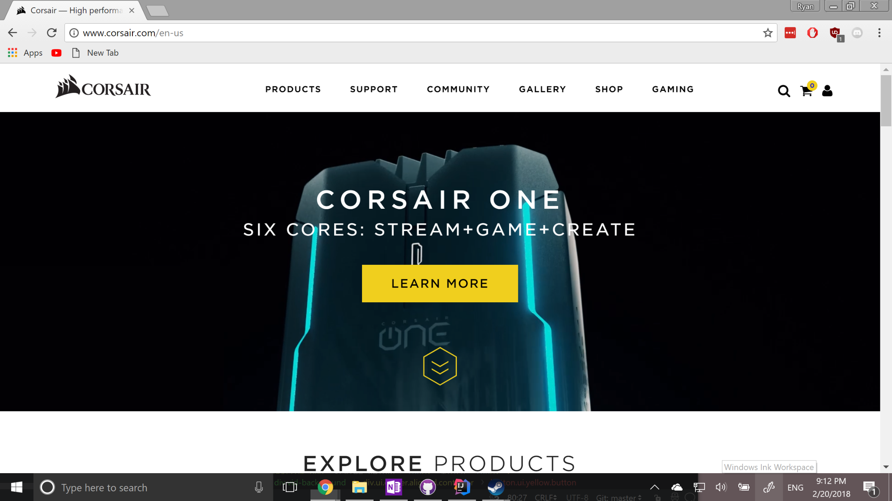

Web design for everyone

Over the past two weeks my software engineering class has been focusing on website design and UI. We started off with the bare basics by writing our own CSS stylesheets for the first week. As I was going through the routine I found myself googling alot of the examples and just referencing previous assignments having to constantly switch between my IDE and chrome just to look at past examples. In the end the pages were bleak and left something to be desired. The next week we were introduced to Semmantic UI a UI framework that aims to make UI design implementation syntax "semmantic", hence the name.

 
<h1>Original Webpage</h1>

 
<h1>Semmantic Webpage</h1>

 
