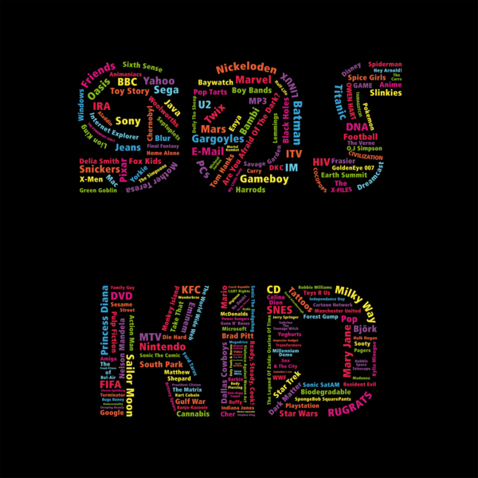
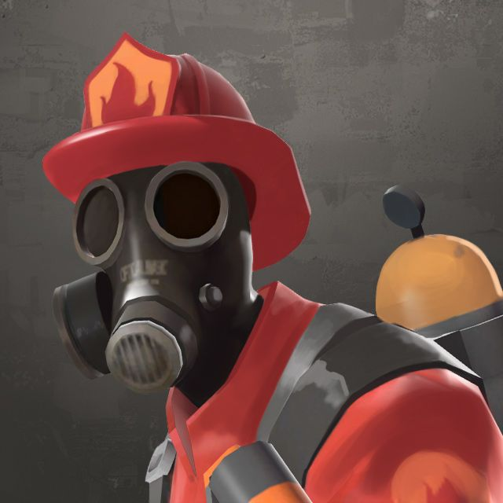

Growing up as a 90s kid I've always been surrounded by computers. I can remember interacting with computers from the beggining. Although I did not recieve my first computer till I was in about the 4th grade I always remember going to CompUSA with my dad. My first computer that I recieved was a Macbook and I remember just downloading youtube videos. I couldnt believe that you could watch movies on a battery powered machine instead of watching my brother and sister's hand me down VHS anime on our 100lb CRT TV I was streaming anime off the internet through the air no tapes required.

Throughout highschool I became an avid PC gamer. I remember playing TF2 and trading virtual items to try to make money. This is where I was first introduced bots. Players would setup Bot accounts that allowed them to automatically make trades with others for a profit I couldn't believe they just made money by doing nothing! After a few google searches I found people had shared their code on a site called github but I didn't know what any of it meant. I had kept this in mind until I entered college and declared my major in CS.

I am now taking my first software engineering class where I hope to better my understanding of coding. What I would love to take from this class is to be able to make my own tools. Whether it be a Item trading bot or a security tool that I can apply to my other classes. I want to code for myself. I feel inorder for me to become proficient at coding I have to learn to solve my own problems by making tools for myself.

