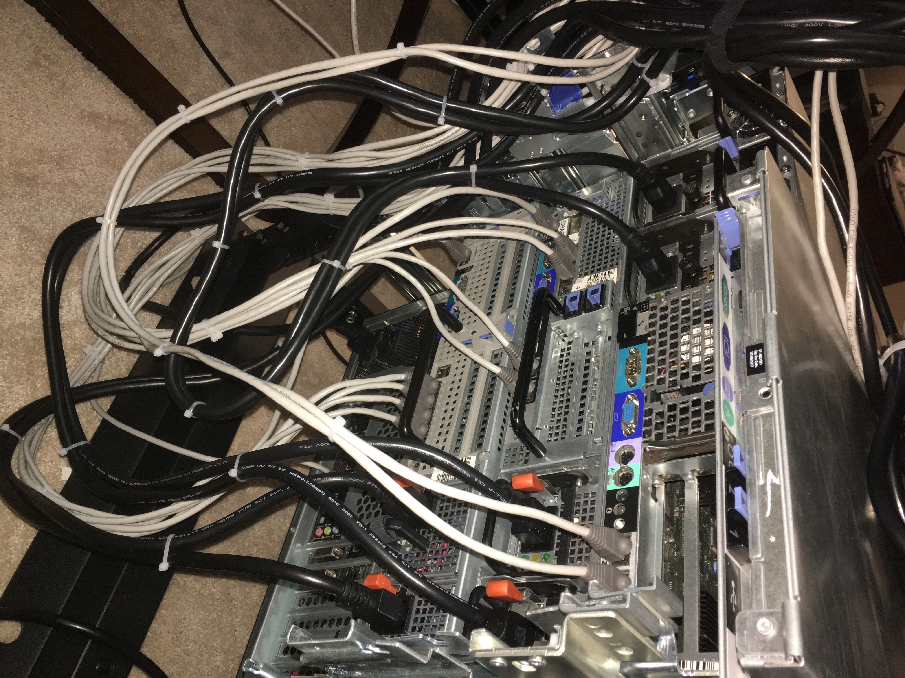

After taking my first security class I became obsessed with the idea of creating the ultimate home network. Something that was talked about in my class was pfsense and vlan tagging. For about the past year I have been accumulating cheap server parts off the internet and trying to work towards the ultimate home network/home lab. At one point I purchased 3 dell servers for about 20 dollars a piece off craigslist so I went out and bought a rack for my servers. Having a rack was an interesting experience because it forced me to make around 50 ethernet cables, calculate electricity usage/cost and it got me addicted r/homelab.
 
 
 
 

Some of the applications that I am or currently have played with are pfsense, open vpn, esxi hyper visor, windows server 2016 and free nas. I enjoy having my own home lab because I can do whatever I want with it and I get to make my room feel like an oven. Currently for my 425 class we are playing with snort which I have now installed on pfsense. I feel having my own home lab allows me to experiment in a controlled enviroment by just moving a few cables on my patch panel I can be disconnected fromt the internet.

Here is an excellent video of a guy from r/homelab giving a tour of his homelab. <a href = "https://www.youtube.com/watch?v=nRmNSJAuBmg">link</a>
