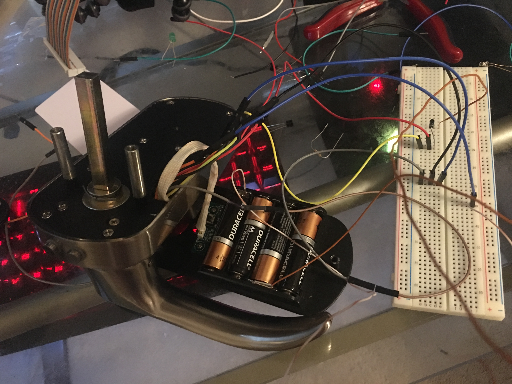
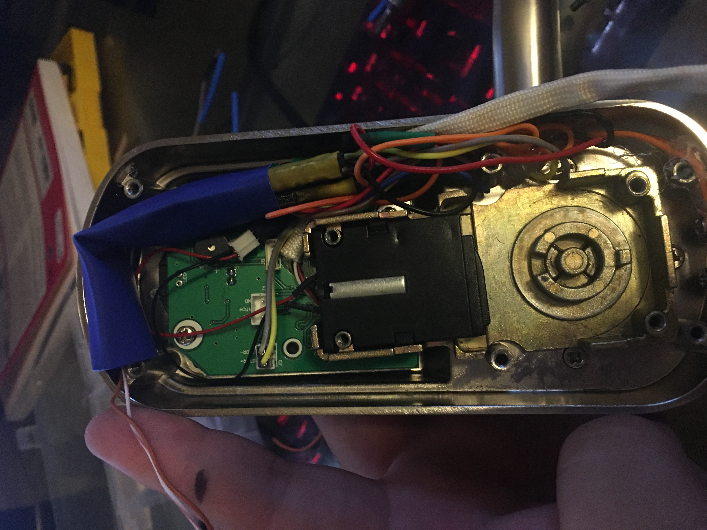
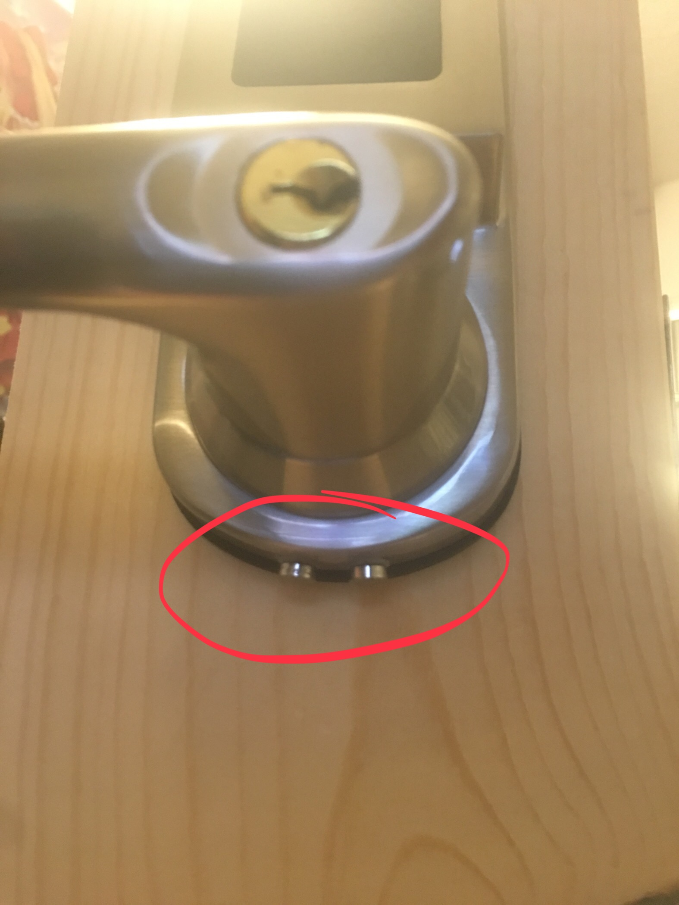

  
  
  
  
  

In ICS 423(Cryptography) we are assigned a final project where we teach the class about a security related issue. We were given a list of research papers to choose from and I ended up choosing Power Replay Attacks in Electronic Doorlocks. The point of this attack is to circumvent the original unlocking mechanism whether it be bluetooth a keypad or even an NFC reader as was my case by installing a hardware backdoor that can be used to activate the locks unlocking mechanism.  Ever since I went to Defcon 25, I've found myself obsessed with picking locks and I felt that this was another method of opening doors that I never heard of. We were given free reign over what we wanted to do for the project. I believe in security in layers and I feel my home follows that layout. I have on my door an electronic door lock which after reading the research paper I found was also vulnerable to the same attacks. After discovering this fact I couldn't help but open up my lock and tinkering with it. I found that unlike the locks in the research paper, my lock used a small motor that turned a small corkscrew which would then engage the lock. In the end, I just ended up using breadboard icsp female wires to connect it to a breadboard. I then powered on the device and measured the voltages across the different leads with a volt meter. I found out that the motor used just under 4 volts. Now that I knew how much voltage I would need I had to find a power source. My door lock was powered by 4 AA batteries. Each AA battery is about 1.5 volts. 3 AA batteries in series are about 4.5 volts which is basically the voltage that I would need to power my motor. I ended up cutting a soda can into a square and soldering a wire to each of them and putting them between three batteries. Now I needed a switch to actually engage my lock. In the research paper they decided on using a bluetooth enabled microcontroller. I instead found my own method of rewiring the backup power leads at the bottom of the lock into a switch. To activate the switch you take a conductive object as a key and it completes the circuit opening the door. After testing it out of the bread board I put it together and it worked. Since I was going to present it in front of my class I wanted to make a stand for my doorlock. Looking up store displays for door knobs turned out to be a nightmare as I found myself wondering whether I really wanted to pay 75 dollars for a display. I found myself making a few trips to Lowes and made a display stand for my project instead for about 10 dollars. In the process of making the stand I got to learn how the mechanisms on door locks work and showcase my maker skills. I was always into picking locks but never knew what happened outside of the pin tumbler and cutting and drilling the holes really gave me a deeper understanding. Since I kept my project low tech and had minimum soldering, I was able to remove my backdoor and return the lock to normal operation.

I feel this project was a perfect way to showcase my passions and I found myself really enjoying the process of making this project from hacking my door lock to making a display.

Here is a copy of my final presentation as a <a href="../files/iCS423FinalPresentationPowerReplayAttacksRyanNakata.pdf">pdf</a>.

Here is a link to the research paper I was assigned. <a href="https://www.ieee-security.org/TC/SP2014/posters/OHSEO.pdf">https://www.ieee-security.org/TC/SP2014/posters/OHSEO.pdf</a>

Please check out the original author of the research paper.
Poster: Power Replay Attack in Electronic Door Locks
Seongyeol Oh, Joon-sung Yang, Andrea Bianchi, Hyoungshick Kim
College of Information and Communication Engineering Sungkyunkwan University Suwon, Republic of Korea
Email: {seongyeol, js.yang, abianchi, hyoung}@skku.edu
 
